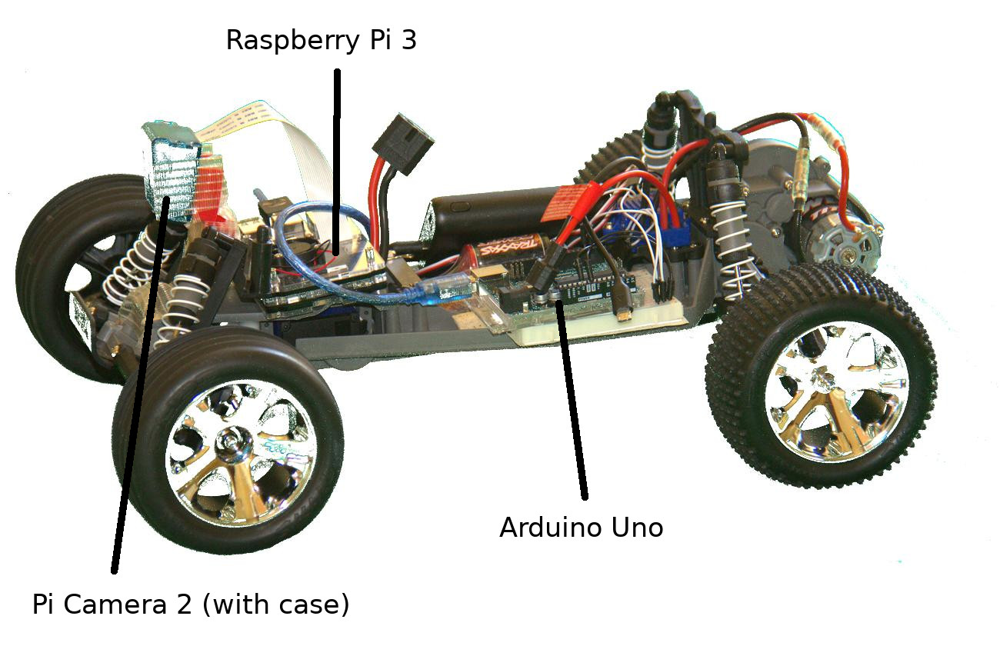
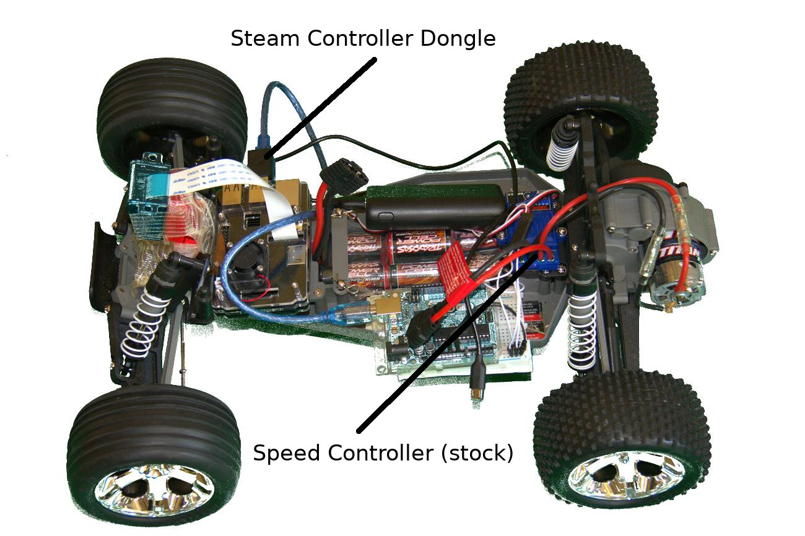
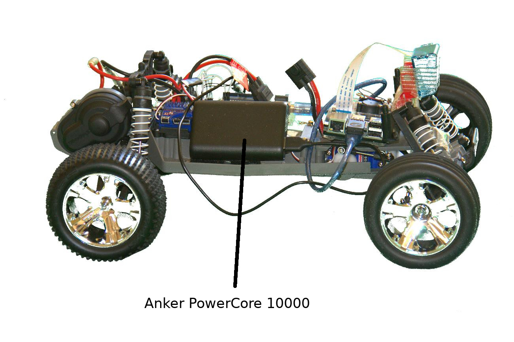

<!---
  EOgmaDrive
  Copyright(c) 2017 Ogma Intelligent Systems Corp. All rights reserved.

  This copy of EOgmaDrive is licensed to you under the terms described
  in the EOGMADRIVE_LICENSE.md file included in this distribution.
--->

# Configuration1

Parts:

- Traxxas Rustler 
- Raspberry Pi 3
- Anker Powercore 10000
- Arduino Uno R3
- Steam Controller (w/ dongle)
- Elduino Pi 3 case with mini fan
- Pi Camera v2
- Pi Camera Case (blue)
- 2x EBL 18650 3.7v 3000mAh Li-ion Rechargable Batteries (for Arduino)
- 18650 2 battery holder
- Miscellaneous: Wires, breadboard, charger (for 18650), double-sided foam tape, crimps

## Overview of Configuration

The Steam controller is used to remotely control the car for training. The Pi communicates with the Arduino using serial, where the Pi sends the Arduino motor commands for the steering/throttle. The Anker PowerCore powers the Pi 3, and high-drain 18650 Li-ion batteries are used to power the Arduino/servo/ESC (not enough amps from just the PowerCore).

An older version of this configuration had the Steam controller communicate with a Pi-Top instead of the car directly, and then used a radio module to communicate with the car. However, just using the steam controller directly improved responsiveness and range is sufficient. The Steam controller dongle is now plugged directly into the Pi 3, where it uses an Xbox360 emulation driver to allow Pygame to detect it [https://github.com/ynsta/steamcontroller](https://github.com/ynsta/steamcontroller).

- SDC\_Transmitter.ino contains the old transmitter code for the older RF version of this configuration (no longer used)
- SDC\_controller.ino contains the old receiver code for the older RF version of this configuration (no longer used)
- SDC\_controller\_norf.ino contains the final (no RF) code used in the Arduino
- SDC3\_sc.py, sdc\_fast\_line.py, and sdc\_master\_sc.py contain the Pi 3 controller scripts. These are all variations of each other, but the sdc\_fast\_line version performs the best.

Images:

## License and Copyright

 The work in this repository is licensed under the <a rel="license" href="http://creativecommons.org/licenses/by-nc-sa/4.0/">Creative Commons Attribution-NonCommercial-ShareAlike 4.0 International License</a>. See the  [EOGMADRIVE_LICENSE.md](https://github.com/ogmacorp/EOgmaDrive/blob/master/EOGMADRIVE_LICENSE.md) and [LICENSE.md](https://github.com/ogmacorp/EOgmaDrive/blob/master/LICENSE.md) file for further information.

Contact Ogma via licenses@ogmacorp.com to discuss commercial use and licensing options.

EOgmaDrive Copyright (c) 2017 [Ogma Intelligent Systems Corp](https://ogmacorp.com). All rights reserved.
