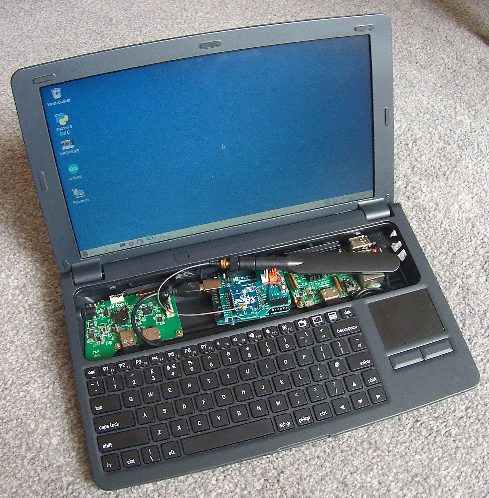
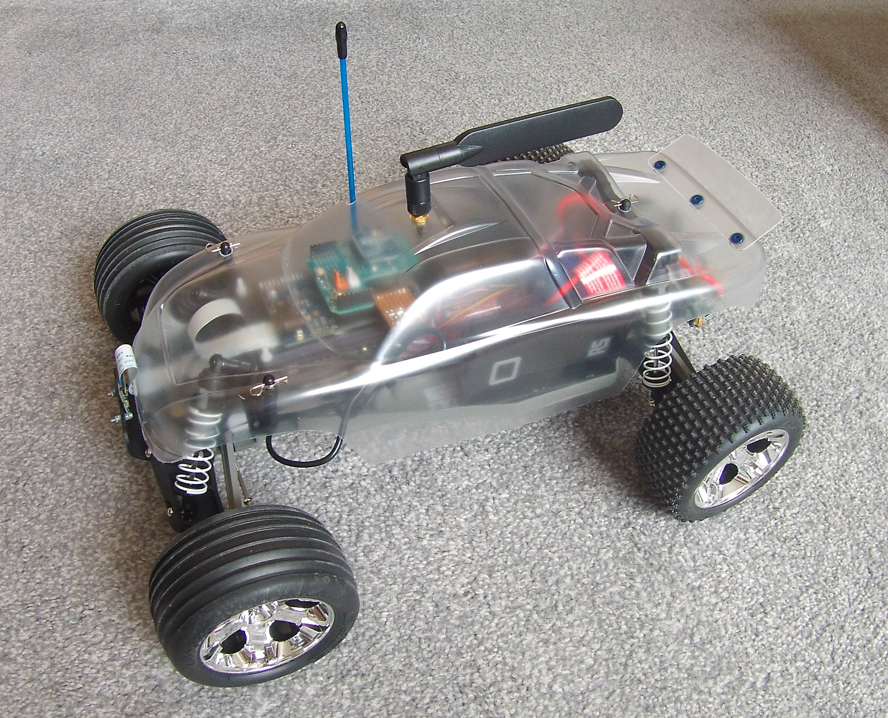
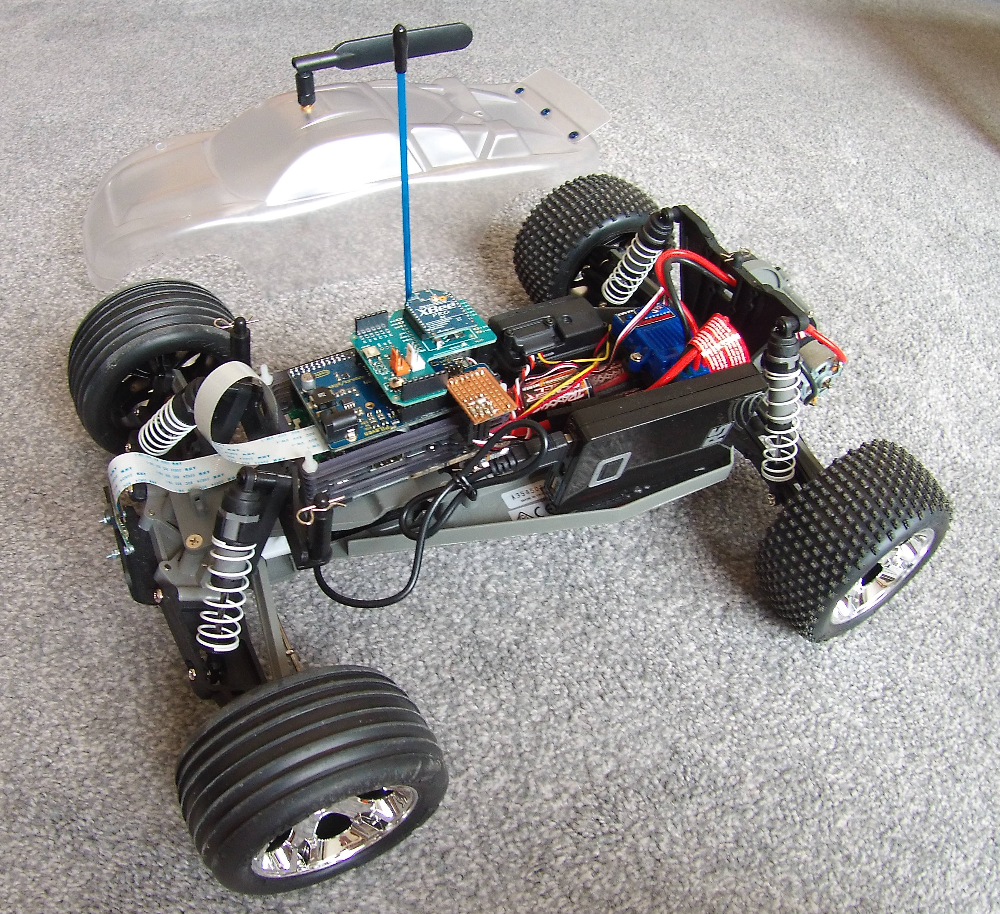
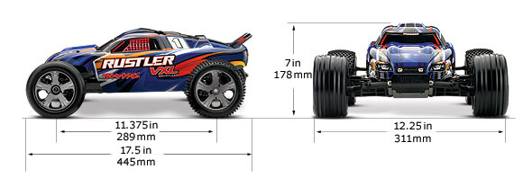

<!---
  EOgmaDrive
  Copyright(c) 2017 Ogma Intelligent Systems Corp. All rights reserved.

  This copy of EOgmaDrive is licensed to you under the terms described
  in the EOGMADRIVE_LICENSE.md file included in this distribution.
--->

# Configuration2

# Base station

The PiTop base station is only required to toggle between training and prediction modes on the SDC. And to optionally allow for a SSH shell, and/or remote desktop, into the SDC RPi for diagnostic purposes.

- [Pi-Top](https://pi-top.com)
- [Raspberry Pi3](https://www.raspberrypi.org)
- [Arduino](https://www.arduino.cc) UNO (or Leonardo, connected via USB to RPi)
- [XBee Arduino shield](https://www.arduino.cc/en/Main/ArduinoXbeeShield) (v1.0 or modified v1.3)
- [XBee Pro](https://www.digi.com/lp/xbee) (Series 1, with u.fl antenna)
- [USB WIFI (802.11 b/g/n) adapter](https://thepihut.com/products/usb-wifi-adapter-for-the-raspberry-pi) (Optional)

Image 1: PiTop with an Arduino Uno and XBee Pro RF module and antenna.  

## Optional: Pi-Top as a WiFi Access Point and DHCP server

The Raspibery Pi3 installed into the Pi-Top can be setup as a WiFi access point and DHCP server. This allows for the RPi on the SDC to wirelessly connect to the Pi-Top RPi, and for a SSH shell to be created on the Pi-Top RPi.

Instructions for how to set this up can be found here: https://learn.adafruit.com/setting-up-a-raspberry-pi-as-a-wifi-access-point/overview

Connection range is limited when using WiFi, so this is only required to be able to access the SDC RPi when on the field/track.

## Arduino XBee Shields

Using an Arduino board that uses a single UART for both USB and shield communication (D0 and D1), such as the Uno or Duemilanove, requires modification to the shield dependant on the version:

- v1.0 ./docs/XbeeShieldSchematic.pdf  
For the v1.0 version of the shield it is simply a case of removing the jumpers on JP2 and JP3. Then connecting pin 2 of JP2 to pin 3 of J1 (D2 on the Arduino), and pin 2 of JP3 to pin 4 of J1 (D3 on the Arduino).

- v1.3 ./docs/Arduino_Shield_Xbee_Rev1_3.pdf  
For the v1.3 version of the shield two tracks need to be cut (tracks B and E out of SW1). Then connecting pin 2 of XB1 to pin 3 of J1 (D2 on the Arduino), and pin 2 of IC2 to pin 4 of J1 (D3 on the Arduino).

This modification then allows the Arduino SoftwareSerial library to use D2 (Rx) and D3 (Tx) to communicate exclusively with the XBee Pro.

*NOTE 1:* When using the XBee shield with the PiLeven this modification is not required. The PiLeven and RPi can communicate via an i2c interface.  
*NOTE 2:* An alternative method would be to use an Arduino Leonardo. That creates a CDC-ACM USB connection with the RPi, leaving the Leonardo UART to be used with the XBee Pro.

## PiTop to SDC communication

PiTop RPi Python serial connection to the Arduino (over USB). Arduino connection to the XBee Pro RF module. Upload the `Configuration2/PiTop_XBee_CommTest` sketch to the Arduino. Use the Arduino IDE Serial Monitor to send the following key commands to the SDC Arduino:

- `T` to enter training mode,
- `P` to enter prediction mode,
- `S` to receive the Actual and Predicted steering and throttle values.
- `V` to receive information on the steering and throttle PWM signals.

# SDC

Image 2: The Traxxas Rustler showing the front bumper mounted Raspberry Pi3 camera, blue RF antenna that connects to the Traxxas stock controller, and the black top mounted XBee Pro antenna that connects to the PiTop-housed XBee Pro module.  
 

- [Traxxas Rustler](https://traxxas.com/products/models/electric/37054rustler) RC car (optional clear body)
- [Raspberry Pi3](https://www.raspberrypi.org) (v2, FOV 62.2x48.8 degrees)
- [Raspberry Pi Camera](https://www.raspberrypi.org/products/camera-module-v2/) (mounted to front bumper)
- [Pimoroni Pibow case](https://shop.pimoroni.com/collections/pibow)
- [Freetronics PiLeven](https://www.freetronics.com.au/collections/raspberry-pi/products/pileven-arduino-compatible-expansion-for-raspberry-pi#.WQcnD1KZPVo) (Arduino compatble, i2c to RPi, UART to XBee)
- [XBee Arduino shield](https://www.arduino.cc/en/Main/ArduinoXbeeShield)
- [XBee Pro](https://www.digi.com/lp/xbee) (Series 1, with u.fl antenna)
- [Power Bank](http://uk.rs-online.com/web/p/power-banks/7757508/) (at least 2A @ 5V, to PiLeven or RPi)
- Servo pass-through connector (attached to PiLeven)

Image 3: Internal components - RPi3 in a grey Pimoroni Pibow case, connected to a PiLeven RPi hat, connected to a XBee Pro RF module and shield, a protoboard servo pass-through connecter intercepting the front servo and ESC connections, a front bumper mounted RPi camera v2, and a 2A Power bank for powering the RPi3 and PiLeven.  

## PiLeven (Arduino) RPi hat

Using a PiLeven RPi hat allows for the use of i2c communications with the SDC RPi. Freeing up the PiLeven UART for use by the XBee Pro RF unit.

### PiLeven_XBee_CommTest

Python SMBus library for Wire (i2c) communication between RPi and PiLeven. PiLeven (Arduino) Serial UART to XBee Pro communication.

https://github.com/freetronics/PiLeven/wiki/I2C

## Servo pass-through connector

The front steering servo connection with the Traxxas Rustler RF module is intercepted via headers soldered to the PiLeven. With Gnd and Power pass-through, and the signal line connected via D8 and D9 shield connections with the PiLeven (Arduino).

This allows for the PiLeven to monitor the steering PWM signal coming from the Traxxas RF module. This monitored PWM signal is sent to the SDC RPi for input into the EOgmaNeo library, and the predicted steering angle out of EOgmaNeo can then be passed back from the RPi to the PiLeven, to be used as the alternative steering PWM signal. During training the monitored PWM signal can be passed directly though to the front steering servo.

## Throttle pass-through connector

The ESC XL5 motor controller connection with the Traxxas Rustler RF module is intercepted via headers soldered to the PiLeven. With Gnd and Power pass-through, and the signal line connected via D10 and D11 shield connections with the PiLeven (Arduino).

## SDC RPi Controller script

The `RPi_Controller.py` Python script is the main software controlling:
- the EOgmaNeo learning algorithm, 
- communication with the PiLeven and XBee Pro RF module,
- handling the RPi camera image stream (Yuv format, only Y/Luminance used),
- using Pillow to perform edge-filtering of the Luminance camera image,
- receiving steering angles from the PiLeven,
- predicting steering angles and forwarding to the PiLeven.

The `PiLeven_Controller` Arduino sketch requires uploading to the PiLeven via the Arduino IDE. It handles:
- communication with the SDC RPi and XBee Pro RF module,
- sends steering value to the SDC RPi,
- receives predicted steering value from the SDC RPi,
- receives via the XBee Pro commands from the Pi-Top.

# Misc

## Python packages

Install OpenCV via https://github.com/jabelone/OpenCV-for-Pi
> pip3 install -r requirements.txt

## Traxxas Rustler vs Unity Stockcar dimensions

  
http://rustlervxlguide.blogspot.co.uk/2012/03/rustler-vxl-specs-from-traxxas.html

|   | Traxxas Rustler | Unity Stockcar model |
|---|---|---|
| Length | 44.5 cm | 2 units |
| Width  | 31.1 cm | 0.75 units |
| Height | 17.8 cm | 0.6 units |

## License and Copyright

 The work in this repository is licensed under the <a rel="license" href="http://creativecommons.org/licenses/by-nc-sa/4.0/">Creative Commons Attribution-NonCommercial-ShareAlike 4.0 International License</a>. See the  [EOGMADRIVE_LICENSE.md](https://github.com/ogmacorp/EOgmaDrive/blob/master/EOGMADRIVE_LICENSE.md) and [LICENSE.md](https://github.com/ogmacorp/EOgmaDrive/blob/master/LICENSE.md) file for further information.

Contact Ogma via licenses@ogmacorp.com to discuss commercial use and licensing options.

EOgmaDrive Copyright (c) 2017 [Ogma Intelligent Systems Corp](https://ogmacorp.com). All rights reserved.
