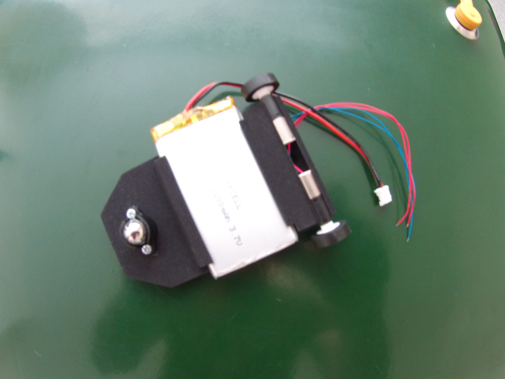
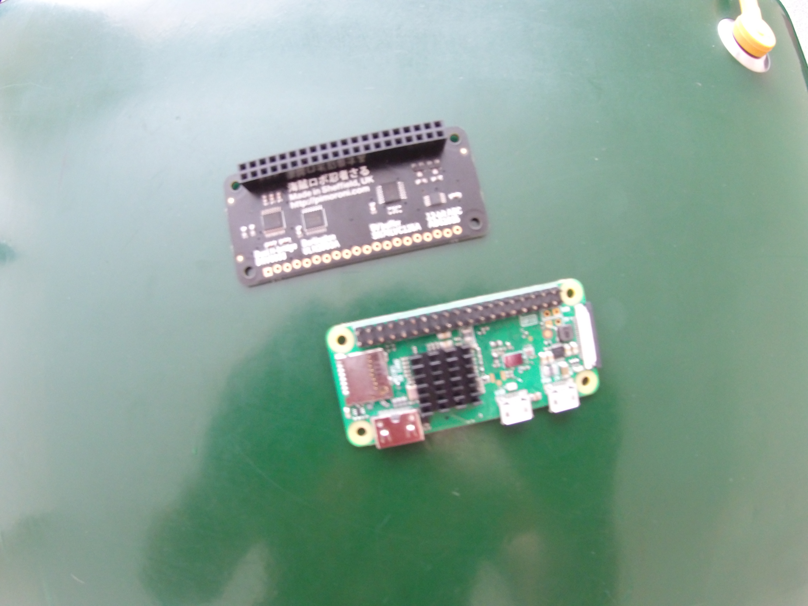
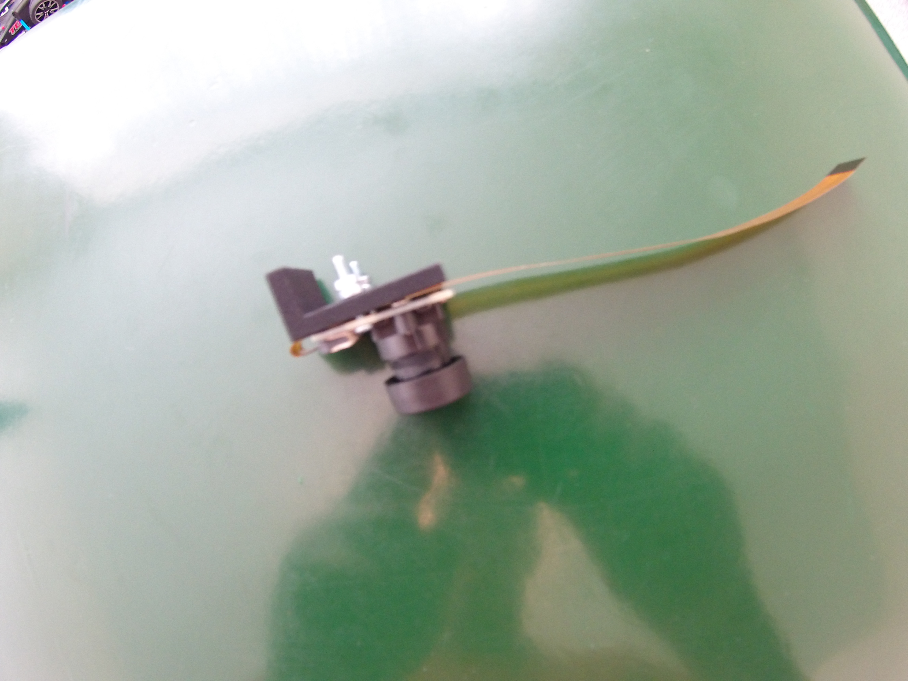
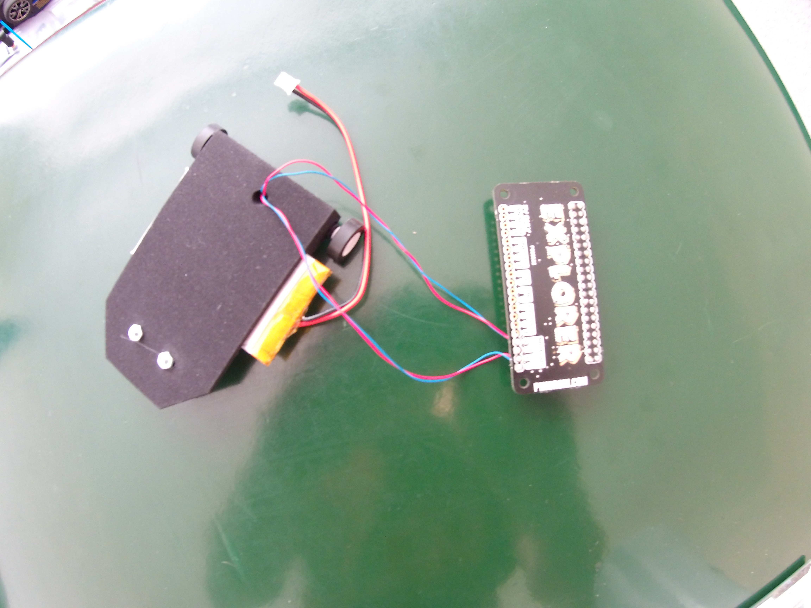
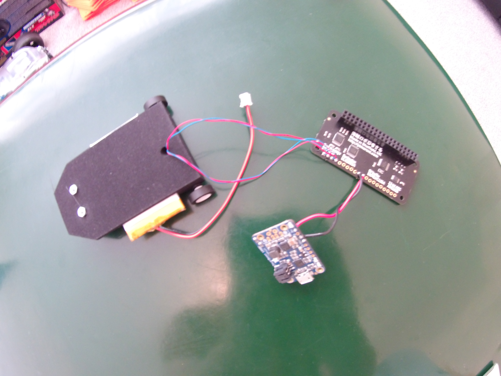
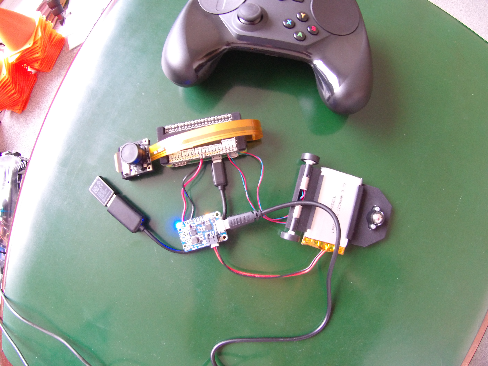
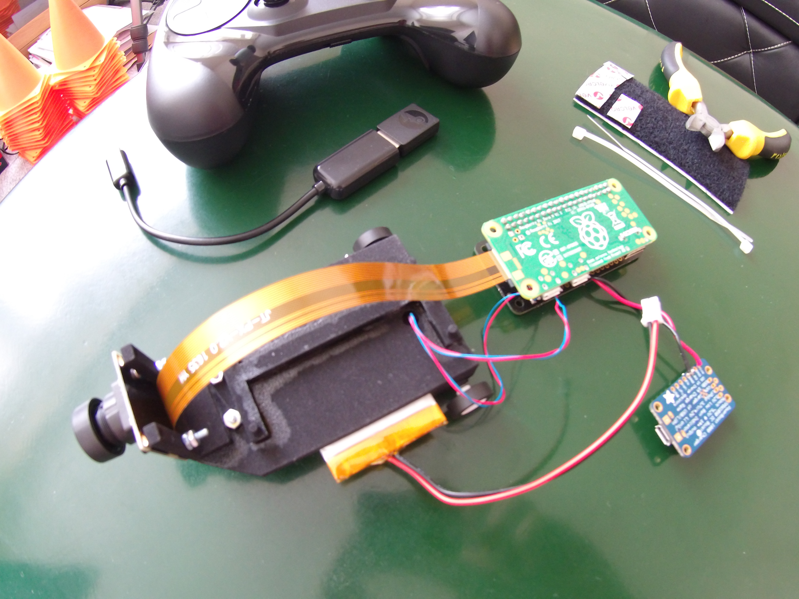
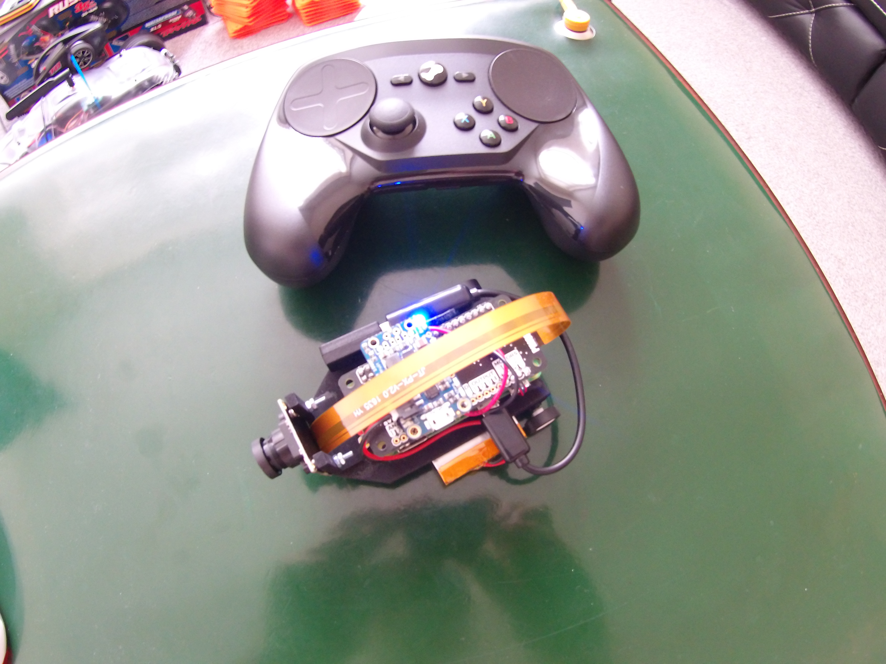

<!---
  EOgmaDrive
  Copyright(c) 2017 Ogma Intelligent Systems Corp. All rights reserved.

  This copy of EOgmaDrive is licensed to you under the terms described
  in the EOGMADRIVE_LICENSE.md file included in this distribution.
--->

# Configuration3 (uSDC)

## Bill of Materials

Refer to the [BillOfMaterials.md](BillOfMaterials.md) for all the items required before assembly.

## Hardware assembly

Figure 1,

- Glue the wheels to the Pololu motors. Take care not to get any glue into the black motor gearbox casing.
- Slot the motors into the base. Feed the motor cables through the hole in the base.
- Bolt the Pololu ball caster to the base. Use the larger spacing plate supplied with the ball caster.
- Slide the Adafruit LiPo battery into the base.

 

Figure 2,

- Solder GPIO headers onto the Raspberry Pi ZeroW (male header) and Explorer pHAT (female header).
- Stick a heat sink onto the Pi ZeroW Broadcom CPU.

 

Figure 3,

- Attach the camera cable to the camera module.
- Bolt the SainSmart camera board to the 3D printed mounting part.
- Connect the camera cable to the Raspberry Pi ZeroW.

 

Figure 4,

- Solder the motors cables to the Explorer pHAT.
  - Blue wires to the Explorer pHAT `Motor-` and Red wires to the Explorer pHAT `Motor+`

 

Figure 5,

- Solder the Adafruit Powerboost connections to the Explorer pHAT.
  - Gnd to Gnd (black wire),
  - 5V and 5V (red wire).
- This step completes all the soldering work, so make sure that all connections are complete.

 

Figure 6, Final connection checks and battery charging.

- Connect the Steam Controller dongle to the Raspberry Pi ZeroW `usb` connector.
- Attach the Explorer pHAT to the Raspberry Pi ZeroW
- Connect the LiPo battery to the Powerboost JST connector.
  - The Powerboost Blue LED should light up.
  - The Green LED on the Raspberry Pi ZeroW will light and flash as it boots into the Raspbian Jessie (Lite) OS.
- Connect a PC/Laptop to the Powerboot USB.
  - The Powerboost Orange LED will light to show that it is charging the LiPo battery.
  - The Powerboost Orange LED will change to Green when charging is complete.

Notes:

- The Powerboost USB connection can be removed once the battery has been charged. The Powerboost will then continue to supply battery power to the Raspberry Pi ZeroW.
- Enabling WiFi on the Raspberry Pi ZeroW will allow for SSH shell access into it. See the [SoftwareInstallation.md](SoftwareInstallation.md) file for further details.

 

Figure 7,

- Glue the Camera mount to the front of the base.
- Glue the Pi mount onto the base part.

 

Figure 8,

- Place the Raspberry Pi ZeroW and Explorer pHAT, onto the mounting part.
- Mount/Velcro the Powerboost board on top of the Explorer pHAT.
- Re-connect the Steam Controller dongle to the Raspberry Pi ZeroW. Zip-tie/Velcro it in place.
- Re-connect the LiPo battery to the Powerboost JST connector.

 

**Congratulations!** The build is complete.

The next steps are described in the [SoftwareInstallation.md](SoftwareInstallation.md) file.

## License and Copyright

 The work in this repository is licensed under the <a rel="license" href="http://creativecommons.org/licenses/by-nc-sa/4.0/">Creative Commons Attribution-NonCommercial-ShareAlike 4.0 International License</a>. See the  [EOGMADRIVE_LICENSE.md](https://github.com/ogmacorp/EOgmaDrive/blob/master/EOGMADRIVE_LICENSE.md) and [LICENSE.md](https://github.com/ogmacorp/EOgmaDrive/blob/master/LICENSE.md) file for further information.

Contact Ogma via licenses@ogmacorp.com to discuss commercial use and licensing options.

EOgmaDrive Copyright (c) 2017 [Ogma Intelligent Systems Corp](https://ogmacorp.com). All rights reserved.
