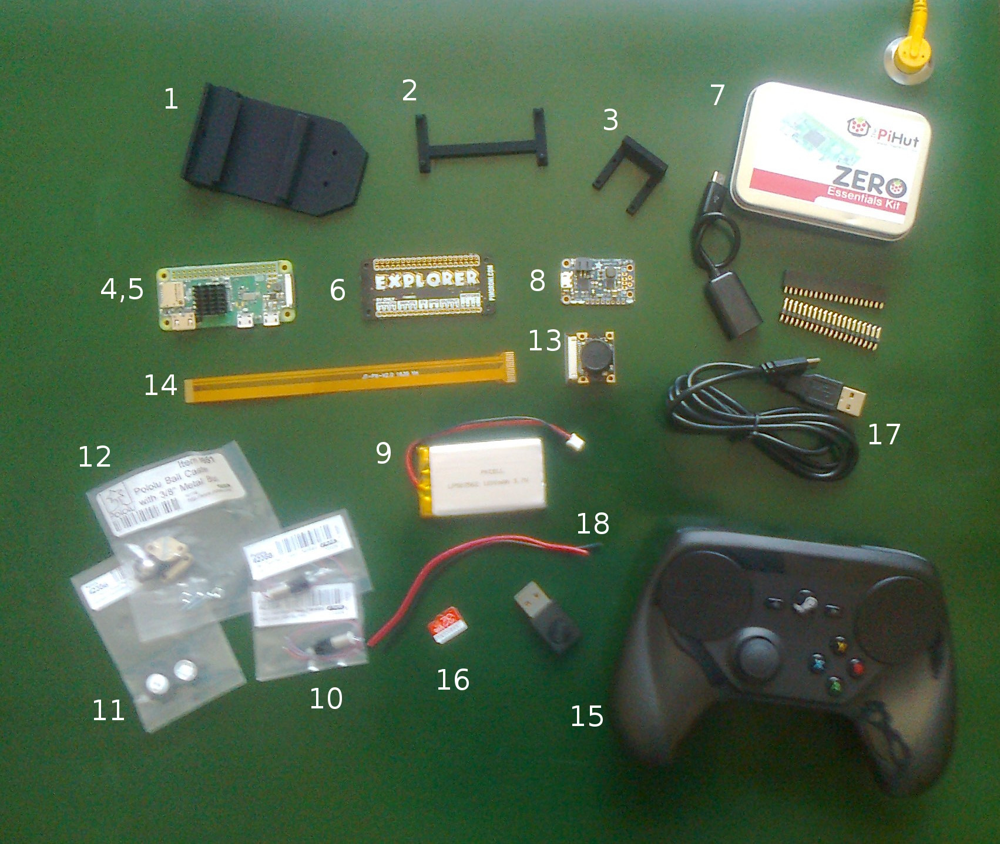

<!---
  EOgmaDrive
  Copyright(c) 2017 Ogma Intelligent Systems Corp. All rights reserved.

  This copy of EOgmaDrive is licensed to you under the terms described
  in the EOGMADRIVE_LICENSE.md file included in this distribution.
--->

# Configuration3 (uSDC)

## Bill of Materials

Refer to the following tables for details of the numbered items in this image:

### 3D printed parts

| Item # | STL Filename | Description |
| --- | --- | --- |
| 1 | base.stl | Main base for the uSDC |
| 2 | piMount.stl | Mounting frame for Pi ZeroW |
| 3 | camMount.stl | Mount for RPi camera |

Notes:

1. The main base part has three through holes: One rear diagonal hole that allows the motor cables to thread through from the mounting cylinder for the motors. And two front holes (13.462mm spacing) for mounting the ball caster.
1. The Pi ZeroW and Camera mounting parts require the appropriate glue to position them onto the base platform. The type/kind of glue is dependant on the material used when 3D printing all the parts. For example, when a Nylon PA2200 based material is used Araldite (epoxy adhesive) is recommended.

### Electro-mechanical parts

| Item # | Manufacturer | Description | Part # |
| --- | --- | --- | ---: |
| 4 | [Raspberry Pi](https://www.raspberrypi.org/) | Main processing board | [Zero W](https://www.raspberrypi.org/products/raspberry-pi-zero-w/) |
| 5 | - | Heatsink for the Raspberry Pi Zero Broadcom CPU (~6mm height) | [example](https://shop.pimoroni.com/products/heatsink) |
| 6 | [Pimoroni](https://shop.pimoroni.com/) | Pi Zero HAT containing two H-bridge motor drivers | [Explorer pHAT](https://shop.pimoroni.com/products/explorer-phat) |
| 7 | [The Pi Hut](https://thepihut.com/) | Pi Zero Essentials Kit that *importantly* includes a male MicroUSB to female USB adapter, and dual-row male and female GPIO headers | [Zero Essentials Kit](https://thepihut.com/products/raspberry-pi-zero-essential-kit) |
| 8 | [Adafruit](https://www.adafruit.com/) | PowerBoost 1000 Charger - Rechargeable 5V Lipo USB Boost @ 1A - 1000C | [2465](https://www.adafruit.com/product/2465) |
| 9 | [Adafruit](https://www.adafruit.com/) | Lithium Ion Polymer Battery - 3.7v 1200mAh | [258](https://www.adafruit.com/product/258) |
| 10 | [Pololu](https://www.pololu.com/) | (x2) 136:1 Sub-Micro Plastic Planetary Gearmotor 6Dx19L mm | [2358](https://www.pololu.com/product/2358) |
| 11 | [Pololu](https://www.pololu.com/) | 14×4.5mm Wheel Pair for Sub-Micro Plastic Planetary Gearmotors | [2356](https://www.pololu.com/product/2356) |
| 12 | [Pololu](https://www.pololu.com/) | Ball Caster with 3/8″ Metal Ball | [951](https://www.pololu.com/product/951) |
| 13 | [Sain Smart](https://www.sainsmart.com/) | Wide Angle FOV160° 5MP Camera Module | [101-40-113](https://www.sainsmart.com/sainsmart-wide-angle-fish-eye-camera-lenses-for-raspberry-pi-arduino.html) |
| 14 | [Sain Smart](https://www.sainsmart.com/) | Camera Cable for Raspberry Pi Zero | [101-40-199](https://www.sainsmart.com/raspberry-pi/camera-module/sainsmart-expansion-development-board-support-arduino-xbee-for-raspberry-pi-a-pi-b-pi-2-model-b-pi-3-model-b.html) |
| 15 | [Valve](http://www.valvesoftware.com/) | Steam Controller (includes a USB dongle) | [info](http://store.steampowered.com/app/353370/Steam_Controller/) |
| 16 | - | Raspberry Pi Zero compatible micro SD / SDHC card | [examples](http://www.raspberry-pi.co.uk/2012/06/07/compatible-sd-cards/) |
| 17 | - | USB to microUSB data cable (connecting a PC/Laptop to the Pi Zero) | |
| 18 | - | Power hook-up wires (connecting the PowerBoost to Explorer pHAT) | |
| - | - | Tools, e.g. solder and iron, wire cutter, glue, non-conductive Velcro/foam tape, etc. | |
| - | - | Nuts and bolts (for connecting the camera module to the mounting part), e.g. M2 x 10/12mm

Notes:

1. Although the motor shafts have a flattened key on them, the motor wheels do not. Therefore it's typical to use a small amount of glue to attach the wheels to the motor shaft. Be careful not to push/bleed glue into the motor gearbox casing.

### Modular track system (optional)

We used an [InfiniTrax](http://infinitrax.com/product.php) (http://infinitrax.com/product.php) "1080 BEAST" modular track system for testing the uSDC. This track can be seen in the YouTube video of the uSDC - https://www.youtube.com/watch?v=9GNbVkMb8Qw

## License and Copyright

 The work in this repository is licensed under the <a rel="license" href="http://creativecommons.org/licenses/by-nc-sa/4.0/">Creative Commons Attribution-NonCommercial-ShareAlike 4.0 International License</a>. See the  [EOGMADRIVE_LICENSE.md](https://github.com/ogmacorp/EOgmaDrive/blob/master/EOGMADRIVE_LICENSE.md) and [LICENSE.md](https://github.com/ogmacorp/EOgmaDrive/blob/master/LICENSE.md) file for further information.

Contact Ogma via licenses@ogmacorp.com to discuss commercial use and licensing options.

EOgmaDrive Copyright (c) 2017 [Ogma Intelligent Systems Corp](https://ogmacorp.com). All rights reserved.
